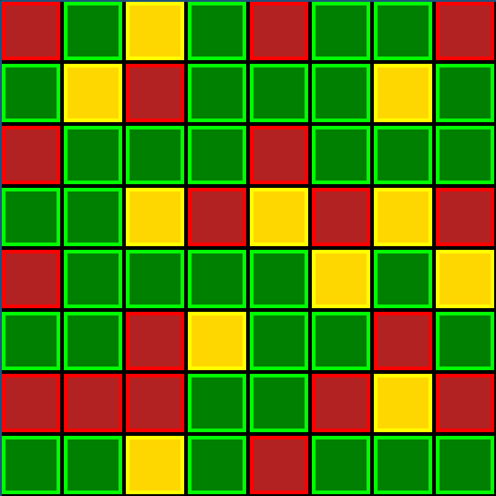

# Traffic Signals: a simple game based on traffic signals(lights) made in godot.

---
## What is the game?
#### This is game where the a setion of the cities traffic signal system is under digital attack, and at the very same time a super important government offical is en route through the same area. It seems obvious the hackers are involved in some kind of attack planned on the pre...precious person. You are a skilled white hat hacker tasked with fighting back!
#### The hackers have a section downtown roads traffic signals stuck in either a green, yellow or red lit state. While traffic can flow through a contiguos path of roads that are all green, that path need to be determined and the appropriate intersections need to be changed to form it. The hackers are good and we cant just simply set all or some of the intersections to functional. We only have the ability to swap the state of a intersection with one of its adjacent neighbors. 
#### Beware though that some intersections can not be swapped and there are other obstacles such as construction zones and blinking red intersections.

---
---
### *Gameplay and rules taken from rules.md*
---
### **Gameplay** - How does it work?
- Start with a randomized but solveable game board with designated entry/exit cells for rows 1 and 8.
- Swap colored "intersections" aka cells(red/green/yellow) so that all rules are satisfied.
- Swap cells of differing color horizontally or vertically. Certain cells may not be swapped immediately or ever.
  - *Cells of the same color may not be swapped as there is no effect in doing so.
- Flashing red, Construction Zone and Terrain cells can not be swapped and have special rules(see below).
- Invalid swaps can be attempted but will quickly undo as a visual hint the move is not allowed.
  - *note that the only invalid swap is 2 cells of the same color or involving cells that may not be swapped*
- A gameboard is completed and won when the completion rule(see below) is satisfied.

---
### **Rules** - What can I do and how can I do it.
##### **Final cell arrangement rules:**
- If a red is above a green cell then the sides of the green cell must contain at least 1 green and 0 reds.
- If a yellow is above a green cell then the sides of the green cell must contain at least 1 green.
- If a green is above a green cell then the sides of the(lower) green cell must contain at least 1 red or yellow.
- Green cells in either edge column have slightly different rules for 2 cases;
  - If a red cell is above, the side of the green(lower) must also be green.
  - If a green cell is above, the side of the green(lower) must be red or yellow.
- Flashing red cells have the same rules and effects as solid red except that they may not be swapped.
- Construction Zone cells have the same rules and effects as yellows except they may not be swapped.
  - *They can however be fixed and turned green with a power up.
- Terrain cells such as water/land/structure etc.. have no roadway and can not be swapped.
##### **Gameplay rules:**
- You may swap 2 cells if they border either horizontally or vertially and they are both swappable.
- You may not swap 2 cells of the same color as it has no effect, nor may you swap any cells that may not be swapped.
  - Flashing red, Construction Zone and Terrain cells may not be swapped.
  - Construction Zones may be fixed(becoming a green) via a power up.
##### **Completion rule:**
- To complete and win a board the following 2 conditions must be satisfied;
  - There must be at least one [`contiguos path`]()[1] of greens connecting the designated cell in [`row 1`]()[2] to the designated cell in [`row 8`]()[2].  
  - All final cell arrangement rules are satisfied(see above).

###### **Rule notes:*
- [1] `contiguos path` is one where cells are connected on cardinal sides i.e. diagonals do not count.
- [2] `row 1` and `row 8` are 0 and 7 respectively in code*

---
---
### Example gameboard(completed and won through H3 to A3).
**G == green, R == red, Y == yellow**
#### *Note: neither of these example game boards contain special cells described in the rules.*

|#|**1**|**2**|**3**|4|**5**|**6**|**7**|**8**|
|-|-|-|-|-|-|-|-|-|
|A| R | G | Y | G | R | G | G | R |
|B| G | Y | R | G | G | G | Y | G |
|C| R | G | G | G | R | G | G | G |
|D| G | G | Y | R | Y | R | Y | R |
|E| R | G | G | G | G | Y | G | Y |
|F| G | G | R | Y | G | G | R | G |
|G| R | R | R | G | G | R | Y | R |
|H| G | G | Y | G | R | G | G | G |
|#|**1**|**2**|**3**|4|**5**|**6**|**7**|**8**|

#### Image of same completed gameboard.

</a>

